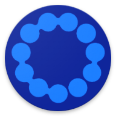
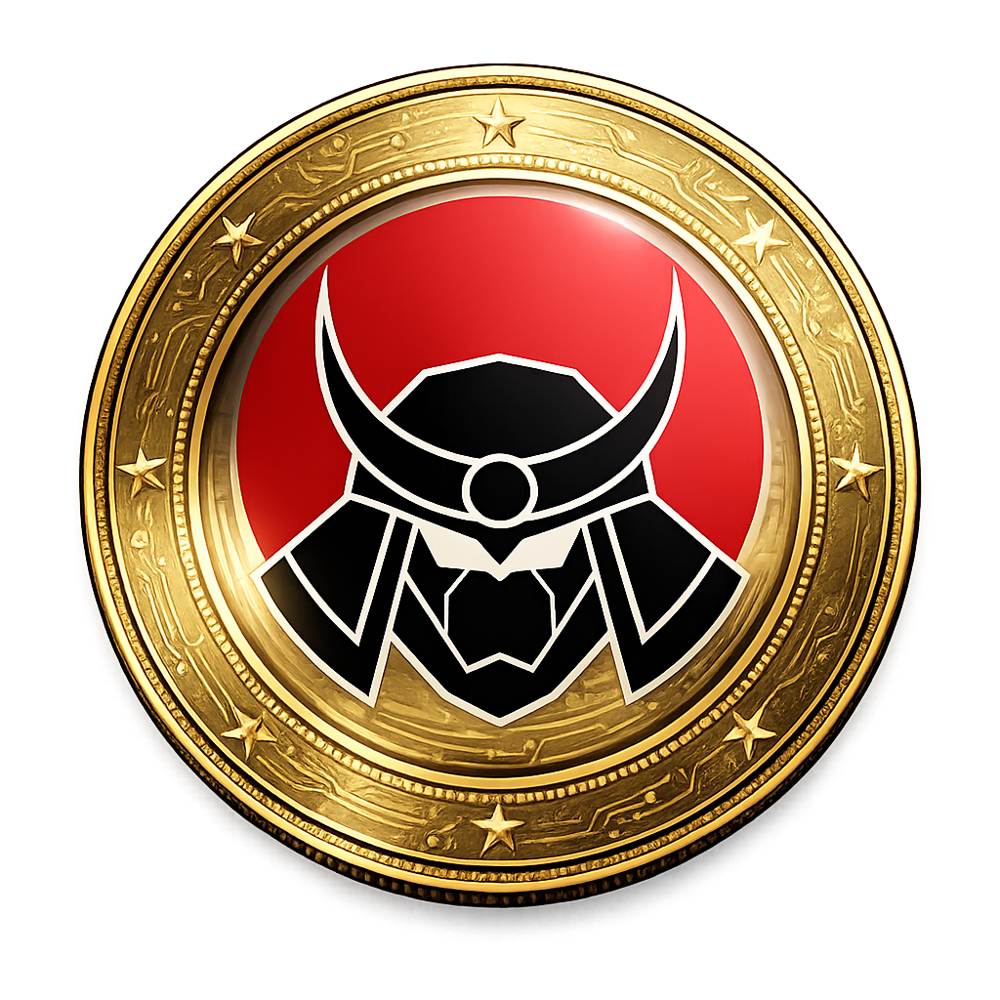
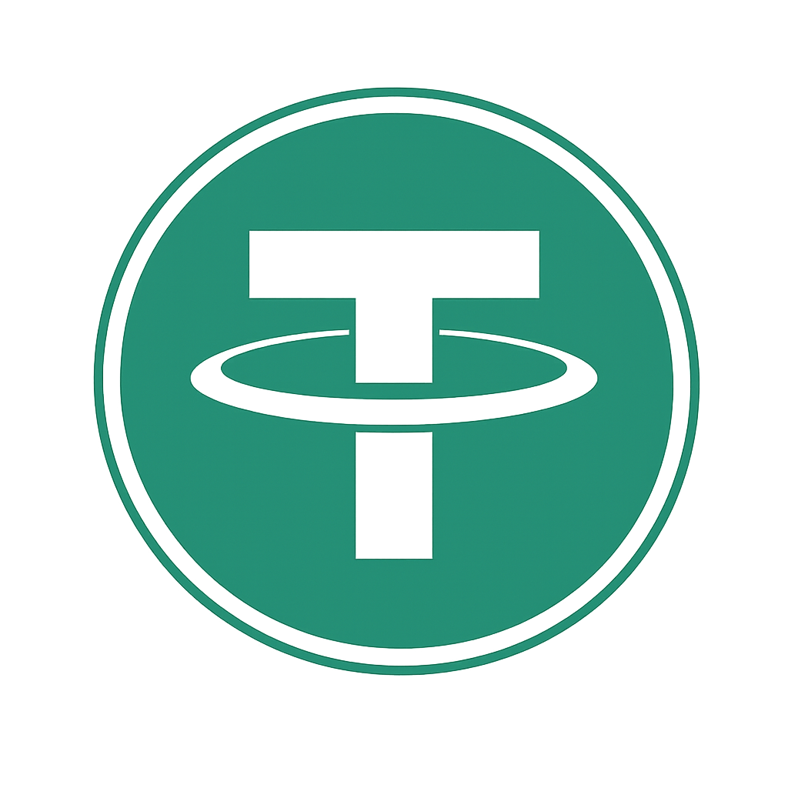

<![CDATA[<p align="center">
  
</p>

<h1 align="center">SATUCHAIN Config</h1>

<p align="center">
  Official configuration repository for SATUCHAIN assets, token lists, and logos.
</p>

<p align="center">
  <a href="https://x.com/SatuChain"></a>
  <a href="https://t.me/satuchain"></a>
</p>

---

## Structure

```text
config/
├── images/              # Brand assets
├── logo/                # SATUCHAIN logo
└── tokenlist/
    ├── satumainnet/     # Mainnet (Chain ID: 10111945)
    ├── satutestnet/     # Testnet (Chain ID: 17081945)
    ├── eth/             # Ethereum
    ├── bsc/             # BNB Smart Chain
    ├── sol/             # Solana
    └── ton/             # TON
```

## Networks

| Network              | Chain ID   | Explorer                                         |
|----------------------|------------|--------------------------------------------------|
| SATUCHAIN Mainnet    | 10111945   | [stuscan.com](https://stuscan.com)               |
| SATUCHAIN Testnet    | 17081945   | [testnet.satuchain.com](https://testnet.satuchain.com) |

---

## Mainnet Tokens

| Logo | Token | Symbol | Contract |
|------|-------|--------|----------|
|  | STU Native | STU | `0x0000000000000000000000000000000000000000` |
|  | USDT SatuChain | USDT | `0xb7d0ba3c125cba8a5b32dded0d2cd072fe4ed81a` |

## Testnet Tokens

| Logo | Token | Symbol | Contract |
|------|-------|--------|----------|
|  | Satu Testnet Native | tSTU | `0x0000000000000000000000000000000000000000` |
|  | Wrapped STU | WSTU | `0x9D863c0Fe98e425054C72Ebdc50655742001c5D1` |
|  | ALP | ALP | `0xce19ca0d0e9ec60655e47fff178670a003fcb1d7` |
|  | Gatotkaca | GTK | `0xcca27b6aa4173404a94a1c94931654acb8248c10` |
|  | Ronin | RNN | `0x6e807d71cf5a40608ea13e3f685a35d375c622ff` |
|  | USD SatuChain | USTU | `0x96fcb228f5a348171598224f1d76008af38a631a` |
|  | USDT SatuChain | USDT | `0xE3717Be7aC5f4dD7118eE0a1b127D8270E3A3d01` |
|  | USDC SatuChain | USDC | `0xb57558E263Fb3789F398faAb45e16C2671AC1044` |
]]>